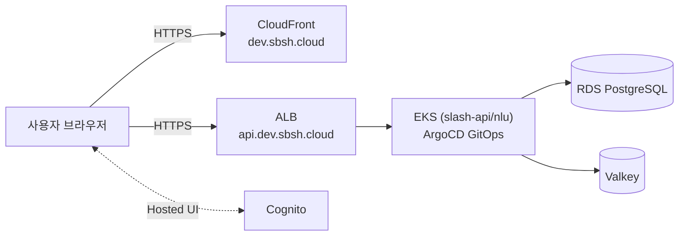

# slash-infra

**Slash** — 자연어 질문과 `/` 슬래시 명령어를 한 입력창에서 함께 쓰는 AI 에이전트 서비스
(`/`는 이 프로덕트의 이름이자 로고이자 명령어 트리거) — 를 올리는 AWS 인프라 저장소. Terraform으로
역할별 재사용 모듈(`modules/`)을 만들고, 환경(`environments/`)에서 조합해 적용한다.
애플리케이션 배포는 Helm 차트(`helm/`) + ArgoCD(GitOps)로 별도 관리한다.

## 목차

- [개요](#개요)
- [저장소 구조](#저장소-구조)
- [기술 스택](#기술-스택)
- [환경 현황](#환경-현황)
- [시작하기](#시작하기)
- [State 백엔드 + DNS 부트스트랩 (최초 1회)](#state-백엔드--dns-부트스트랩-최초-1회)
- [dev 클러스터 상태 확인 (Headlamp)](#dev-클러스터-상태-확인-headlamp)
- [다른 AWS 계정에서 시작하기 (팀원용)](#다른-aws-계정에서-시작하기-팀원용)
- [문서 맵](#문서-맵)
- [관련 저장소](#관련-저장소)

## 개요

Slash 백엔드 서비스군(`slash-api`/`slash-nlu`, 그리고 현재는 배포하지 않는 `slash-llm`)과
프론트엔드(`slash-web`)가 올라가는 AWS 인프라 전체를 코드로 정의한다.
`slash-runner`(사용자 PC에서 로컬 실행)는 AWS 범위 밖이라 이 저장소가 다루지 않는다.



**2026-08-25부터 LLM/GPU 경로는 쓰지 않는다** — 제품 방향이 "클라우드에서 LLM을 직접
제공하지 않는다"로 바뀌면서 `slash-llm`의 EKS 배포와 Ollama EC2를 모두 destroy했다.
요약 기능은 `slash-api`가 `SUMMARY_ENGINE=EXTRACTIVE`(기본값)로 `slash-nlu`를 거쳐
처리한다. `modules/llm-runtime`/`helm/slash-llm` 코드는 남아있어 필요해지면
`terraform apply` 한 번으로 복원 가능 — 상세는 [`docs/operations-log.md`](docs/operations-log.md)
§23("GPU/클라우드 LLM 인프라 정리") 참고.

전체 토폴로지와 설계 근거는 [`docs/aws-architecture.md`](docs/aws-architecture.md), 요청
한 건이 실제로 어떤 경로를 타는지는 [`docs/user-flow.md`](docs/user-flow.md) 참고.

**공유 계정 주의**: AWS 계정은 부트캠프 여러 팀·수강생이 함께 쓴다. 리소스명에
`slash-` 접두사를 빠뜨리면 다른 팀 리소스와 섞인다 — 자세한 배경은
[`docs/resource-ownership.md`](docs/resource-ownership.md) "계정 자체가 공유 강의용
계정" 절 참고.

## 저장소 구조

```
modules/
  network/             VPC + 3-tier 서브넷(public/private-app/private-db) + SG + S3 Gateway Endpoint + VPC Flow Log
  eks/                 EKS 클러스터 + 관리형 노드그룹 + IRSA(OIDC) + Karpenter/ALB Controller Role + ECR 참조
  database/            RDS PostgreSQL(Multi-AZ) + Valkey(ElastiCache) + Secrets Manager
  llm-runtime/          Ollama용 GPU EC2(g4dn.xlarge) — 2026-08-25 destroy, 코드만 보존(휴면)
  cognito/              Cognito Hosted UI (EMAIL_OTP, OAuth2 code+PKCE)
  observability/        CloudWatch 알람(RDS/ALB/Valkey) + SNS
  frontend-hosting/     S3 + CloudFront + ACM + Route53 (slash-web 정적 호스팅)
  ecr/                   서비스별 ECR 리포지토리(IMMUTABLE 태그)
  backend-cicd/          GitHub OIDC → ECR push용 IAM Role (서비스별)
  frontend-cicd/         GitHub OIDC → S3/CloudFront 배포용 IAM Role
environments/
  bootstrap/            state용 S3 버킷 + Route53 zone + CloudTrail + ECR + backend-cicd Role (계정당 최초 1회)
  local/                개인 실험용 — 대부분 destroy됨, eks만 모듈 검증 테스트베드로 상시 재사용
  dev/                  prod와 거의 동일한 스펙, 상시 운영 중(2026-08-18~)
  prod/                 미구축
helm/                   slash-api/nlu/llm Helm 차트 (서비스별 디렉터리 + 환경별 values, ArgoCD가 감시)
argocd/                 ArgoCD Application 매니페스트
external-secrets/       External Secrets Operator 설정 (Secrets Manager → K8s Secret 동기화)
karpenter/               Karpenter NodePool/EC2NodeClass 매니페스트
docs/                   아키텍처·보안·운영·리소스 소유권·기술 스택 등 설계·운영 문서
```

각 환경 디렉터리는 독립된 Terraform state를 가진다 — 전체를 한 번에 적용할 수도,
바뀐 모듈만 골라 적용할 수도 있다(`-target` 또는 해당 디렉터리에서만 `apply`).

## 기술 스택

인프라는 Terraform 기반 IaC로 관리하고, 애플리케이션 서비스는 서비스 특성에 따라
각기 다른 언어·프레임워크를 쓰는 폴리글랏 구성이다. 서비스별 기술 스택은
[`docs/tech-stack.md`](docs/tech-stack.md) 참고.

| 레이어 | 기술 |
| --- | --- |
| 프로비저닝 | Terraform ≥ 1.10 (S3 `use_lockfile` — DynamoDB 락 테이블 없이 네이티브 락) |
| 앱 배포 | Helm 차트 → ArgoCD (GitOps), 서비스 CI가 `values-dev.yaml`에 이미지 태그 직접 커밋 |
| CI/CD (서비스 저장소) | GitHub Actions → OIDC(임시 자격증명) → ECR push |
| 컨테이너 오케스트레이션 | Amazon EKS (관리형 노드그룹 + Karpenter) |
| 요약 기능 | `slash-api`(`SUMMARY_ENGINE=EXTRACTIVE`) → `slash-nlu` — LLM/GPU 경로는 2026-08-25 destroy(휴면) |
| 데이터베이스 | RDS PostgreSQL 16(Multi-AZ), ElastiCache Valkey(AUTH+TLS) |
| 인증 | Amazon Cognito Hosted UI (`EMAIL_OTP`, OAuth2 code+PKCE) |
| 프론트엔드 호스팅 | S3 + CloudFront + ACM + Route53 |
| 시크릿 관리 | Secrets Manager + External Secrets Operator (컨트롤러엔 AWS 권한 없음, 앱 IRSA로 대리) |
| 관측성 | CloudWatch 알람 7종 + SNS 이메일 통보 |

이 저장소 자체에는 CI/CD 워크플로 파일이 없다(서비스 저장소가 각자 소유) — 빌드 상태
뱃지는 표시하지 않는다.

## 환경 현황

`docs/aws-current-status.md`(2026-08-24 기준)와 `docs/operations-log.md`가 최신 상태의
출처다. 아래는 요약:

| 환경 | 상태 | 비고 |
| --- | --- | --- |
| `bootstrap` | ✅ 적용됨 | state 버킷, Route53 zone, CloudTrail, ECR ×3, backend-cicd Role ×3 |
| `local` | 대부분 destroy됨 | `eks`만 모듈 검증용으로 apply→destroy 반복 재사용 |
| `dev` | ✅ 상시 운영 중 (2026-08-18~) | `dev.sbsh.cloud` / `api.dev.sbsh.cloud` HTTPS로 서비스 중 |
| `prod` | 미구축 | 착수 시 `dev`와 동일 모듈 세트 복제 예정 |

`dev`는 비용 관리를 위해 **EKS 노드그룹/RDS/Ollama EC2만** 매일 09~21시(KST) 스케줄로
켜고 끈다(컨트롤플레인·NAT·Valkey·ALB는 상시 유지) — 자세한 스케줄 변경 이력은
[`docs/operations-log.md` §12-3](docs/operations-log.md#12-3-0921시-스케줄을-평일에서-매일로-확대-2026-08-21),
스케줄 밖에서 수동으로 켜고 끄는 절차는
[§12-2](docs/operations-log.md#12-2-스케줄-밖0921시-외-야간에-수동으로-켜고-끄는-절차-2026-08-21-12-3으로-주말-포함-이후-갱신) 참고.
**수동으로 켰다면 작업이 끝난 뒤 반드시 수동으로 꺼야 한다.**

## 시작하기

`slash-local` / `slash-dev` / `slash-prod` 세 프로필을 미리 나눠뒀다(`~/.aws/config`).
지금은 셋 다 같은 IAM 사용자 자격증명을 가리키지만, 이름을 분리해뒀기 때문에 나중에
단계별로 다른 계정/사용자를 쓰기로 하면 프로필 값만 바꾸면 된다. 아래 명령어는
`--profile slash-local` 또는 `AWS_PROFILE=slash-local`로 실행한다고 가정한다.

```bash
cd environments/local/network
terraform init
terraform plan   # 유효한 AWS 자격증명 필요 (aws sts get-caller-identity로 먼저 확인)
```

`environments/local/network`는 변수 없이 바로 쓸 수 있다(기본값이 이미 local 값). 다른
모듈은 값을 채워야 한다:

```bash
cd environments/local/frontend
cp terraform.tfvars.example terraform.tfvars   # hosted_zone_id는 bootstrap output
terraform init
terraform plan
```

자격증명 없이도 `terraform validate`까지는 로컬에서 확인 가능하다 — `plan`부터
AWS API 호출이 필요하다.

## State 백엔드 + DNS 부트스트랩 (최초 1회)

다른 모든 환경이 remote state로 쓸 S3 버킷과, local/dev/prod가 공유하는 Route53 hosted
zone(`sbsh.cloud`)을 만든다. 이 버킷이 없는 상태에서는 각 환경이 local backend로 동작한다.

```bash
cd environments/bootstrap
terraform init
terraform apply
```

`apply` 후 출력되는 `bucket_name`을 다른 환경의 `backend "s3"` 블록에 연결한다
(DynamoDB 없이 S3 자체 락 기능만 사용, Terraform 1.10+ 필요):

```hcl
terraform {
  backend "s3" {
    bucket       = "<bootstrap이 출력한 bucket_name>"
    key          = "<env>/<service>/terraform.tfstate"
    region       = "ap-northeast-2"
    encrypt      = true
    use_lockfile = true
  }
}
```

`route53_zone_id` 출력값은 `frontend-hosting` 모듈을 쓰는 환경의 `hosted_zone_id`
변수로 넘긴다. `route53_name_servers` 출력값(4개)은 가비아 도메인 관리 화면의
네임서버 설정에 등록해 `sbsh.cloud`를 Route53으로 위임한다. 배경은
[`docs/aws-architecture.md`](docs/aws-architecture.md) §2, §3 참고.

## dev 클러스터 상태 확인 (Headlamp)

리소스 하나하나 AWS 콘솔에서 찾아보지 않고 EKS 파드 상태를 한눈에 보려면
[Headlamp](https://headlamp.dev) 데스크톱 앱을 쓴다(검토 배경: 이슈
[#47](https://github.com/LikeLionTeam4/slash-infra/issues/47)/[#49](https://github.com/LikeLionTeam4/slash-infra/issues/49)).
클러스터에 아무것도 추가로 설치하지 않는 방식이라 비용은 $0.

### 사전 준비 — kubectl 접근 권한 (이슈 [#63](https://github.com/LikeLionTeam4/slash-infra/issues/63))

`slash-eks-dev`는 클러스터를 만든 IAM 사용자 외엔 기본적으로 `kubectl` 접근이 안 된다 — AWS
API 권한(`aws eks describe-cluster` 등)과 Kubernetes RBAC 권한은 완전히 별개라, 계정을 팀이
공유하는 것만으로는 부족하다. 본인 IAM 사용자가 `environments/dev/eks/terraform.tfvars`의
`team_member_arns`에 등록돼 있어야 하며, 안 돼 있으면 담당자에게 추가를 요청한다(추가 방법은
아래 "팀원 추가하기" 참고). 등록되면 별도 로그인 절차 없이 바로 접속된다.

### 설치 및 연결

```bash
brew install --cask headlamp
aws eks update-kubeconfig --name slash-eks-dev --region ap-northeast-2 --profile slash-dev
```

앱을 열고 `slash-eks-dev`(계정 `061039804626`)를 선택하면 연결된다. **워크로드 →
디플로이먼트**에서 파드 수(`N/M`)만 확인한다 — N=M이면 정상:

| 서비스 | 정상 값 |
| --- | --- |
| slash-api | 2/2 |
| slash-nlu | 2/2 |

`slash-llm`은 2026-08-25 EKS 배포 자체를 destroy해서 위 목록에 없다(위 [개요](#개요) 참고) —
Headlamp에도 보이지 않는 게 정상이다.

숫자가 다르면: 해당 디플로이먼트 클릭 → `Running`이 아닌 파드 클릭 → 로그/Events로
원인 확인. ReplicaSet 목록은 안 봐도 된다 — 배포마다 쌓이는 이력이라 대부분 `0/0`이
정상이다.

### 팀원 추가하기

새 팀원이나 아직 등록 안 된 팀원의 kubectl 접근을 열어주려면
`environments/dev/eks/terraform.tfvars`(gitignore 대상 — 이 저장소가 public이라 팀원 IAM
사용자명을 커밋하지 않는다. 형태는 같은 디렉터리의 `terraform.tfvars.example` 참고)의
`team_member_arns`에 ARN을 추가한다.

```bash
cd environments/dev/eks
# terraform.tfvars의 team_member_arns 목록에 ARN 추가 후
terraform plan   # 반드시 먼저 확인 — destroy 없이 add/change만 있어야 정상
terraform apply
```

권한은 `AmazonEKSClusterAdminPolicy`(클러스터 전체 admin)로 전원 동일하게 부여한다 — 조회
전용 권한 분리는 아직 하지 않기로 함(이슈 #63 코멘트 참고).

### 참고

- kubectl 접근 권한은 위 "사전 준비" 참고(이슈 #63) — 계정 공유만으로는 자동 접속되지 않는다.
- 관리형 AWS 서비스(RDS/ALB/Valkey) 상태는 별도 CloudWatch 대시보드에서 확인한다:
  `environments/dev/observability`에서 `terraform output dashboard_url`.

## 다른 AWS 계정에서 시작하기 (팀원용)

부트캠프 계정은 사람마다 따로 발급되므로, 팀원이 이 저장소를 clone해서 apply하면
사실상 **완전히 새 AWS 계정**에서 시작하는 것과 같다 — 계정이 다르면 state를 나눠
쓸 방법이 없어 지금까지 만든 리소스와 전혀 공유되지 않는다.

**사전 준비물**: Terraform 1.10 이상(`use_lockfile` 기능), AWS CLI v2. `local/frontend`까지
테스트하려면 [slash-web](https://github.com/LikeLionTeam4/slash-web) 저장소도 별도 clone.

**순서**:

1. 본인 부트캠프 계정 IAM 액세스 키로 `aws configure` (프로필명은 `slash-local`로
   맞추면 이 문서 명령어를 그대로 복붙 가능).
2. `environments/bootstrap` apply — 본인 계정에 본인만의 state 버킷과 Route53 zone 생성.
3. `environments/local/network` apply — 변수 없이 바로 됨.
4. `environments/local/frontend`는 주의가 필요하다: `bucket_name`(전역 유일)이 다른
   계정에서 이미 선점됐을 수 있고, 무엇보다 본인 계정에 새로 만든 `sbsh.cloud` zone은
   가비아가 위임한 진짜 zone이 아니라서 ACM 인증서 DNS 검증이 영원히 끝나지 않는다 —
   본인이 위임 가능한 다른 도메인을 쓰거나, 이 모듈은 건너뛰고 `network`까지만 연습할 것.
5. destroy는 [`docs/operations-log.md` §5](docs/operations-log.md)의 순서(frontend →
   network → bootstrap)를 본인 계정 안에서 그대로 따르면 된다.

## 문서 맵

| 문서 | 내용 |
| --- | --- |
| [`docs/aws-architecture.md`](docs/aws-architecture.md) | 전체 아키텍처 설계 근거 — 네트워크/EKS/RDS/CI-CD/Cognito 등 결정사항과 이유 |
| [`docs/aws-current-status.md`](docs/aws-current-status.md) | 지금 실제로 떠 있는 리소스 스냅샷 |
| [`docs/operations-log.md`](docs/operations-log.md) | Apply/Destroy 실행 기록, 순서, 트러블슈팅 — 계속 갱신되는 운영 일지 |
| [`docs/resource-ownership.md`](docs/resource-ownership.md) | 어느 리소스를 어느 `environments/*`가 소유하는지 |
| [`docs/security-architecture.md`](docs/security-architecture.md) | IAM/OIDC/보안그룹/시크릿 흐름 — "누가 무엇에 접근 가능한가" |
| [`docs/user-flow.md`](docs/user-flow.md) | 로그인·자유입력 요청·에이전트 페어링이 실제로 타는 경로 |
| [`docs/tech-stack.md`](docs/tech-stack.md) | 서비스별 언어/프레임워크 매핑 |
| [`docs/resilience-testing.md`](docs/resilience-testing.md) | 장애 대응 테스트(게임 데이) 카탈로그 |

## 관련 저장소

| 저장소 | 역할 |
| --- | --- |
| [slash-web](https://github.com/LikeLionTeam4/slash-web) | 웹 클라이언트 — React·Vite UI, S3/CloudFront 배포 |
| [slash-api](https://github.com/LikeLionTeam4/slash-api) | 코어 API — 인증, 작업 관리, 실행 위치 결정, DB 연동 |
| [slash-nlu](https://github.com/LikeLionTeam4/slash-nlu) | 자연어 분석 — slash 명령 파싱, 규칙·Kiwi 의도 분류, 인자 추출 |
| [slash-llm](https://github.com/LikeLionTeam4/slash-llm) | LLM 서비스 — Gemma 추론, 요약·대화 생성 |
| [slash-runner](https://github.com/LikeLionTeam4/slash-runner) | PC 작업 실행기 — PC 파일 검색, 상태 조회, 로컬 AI 실행·결과 전달 |
| **slash-infra** (현재) | 인프라 — Terraform(AWS), Helm·ArgoCD 배포 |
| [slash-docs](https://github.com/LikeLionTeam4/slash-docs) | 프로젝트 문서 — 아키텍처, API 계약, ERD, 회의록 |
