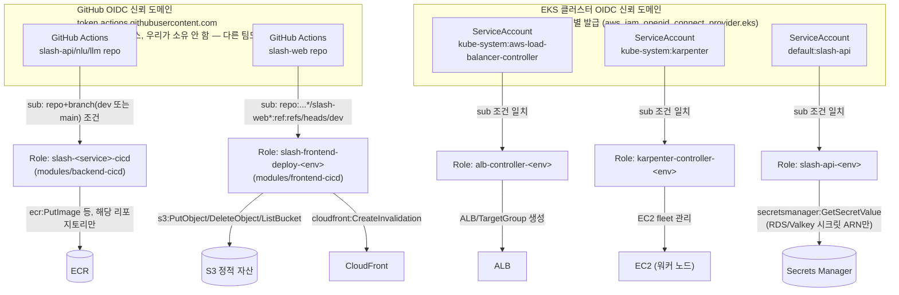
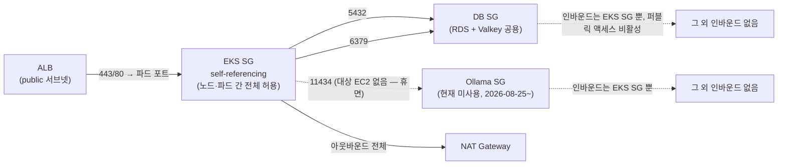
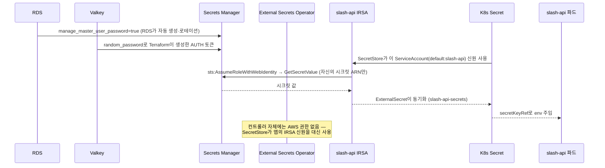

# 보안 / IAM 아키텍처

`docs/aws-architecture.md`에 흩어져 있던 IAM·보안그룹·시크릿 관련 결정(§4-1, §5, §7-1, §9-1)을
"누가 무엇에 접근할 수 있는가" 관점으로 한데 모은 문서. 기준: dev 환경, 2026-08-19,
`modules/eks/*.tf`·`modules/backend-cicd`·`modules/frontend-cicd`·`modules/network`·
`external-secrets/README.md` 실제 코드 기준.

## 1. 두 개의 OIDC 신뢰 도메인 — 절대 섞이지 않는다

이 인프라에는 이름이 비슷해 보이지만 완전히 다른 두 OIDC provider가 있다. `docs/aws-architecture.md`
§9-1이 텍스트로 이미 강조한 구분이고, 여기서는 그림으로 고정한다.

- **GitHub OIDC provider는 우리가 만들지 않는다** — 계정을 공유하는 다른 팀이 이미
  등록해둔 것을 `data` 리소스로 읽기 전용 참조만 한다. 삭제/변경에 절대 관여하지 않는다(§9-1).
- **EKS OIDC provider는 클러스터마다 새로 발급되는 별개 리소스**다 — 클러스터를
  destroy→재생성하면 이 provider도 새로 생기고, 여기 딸린 IRSA Role들의 신뢰 관계
  (`aws_iam_openid_connect_provider.eks.arn`)도 자동으로 새 provider를 가리키게
  Terraform이 처리한다.
- **워커 노드 자체의 IAM Role은 의도적으로 광범위한 권한이 없다** — `AmazonEKSWorkerNodePolicy` /
  `AmazonEKS_CNI_Policy` / `AmazonEC2ContainerRegistryReadOnly` / `AmazonSSMManagedInstanceCore`
  4개뿐(`modules/eks/node_group.tf`). Secrets Manager 접근 같은 애플리케이션 권한은 전부
  파드 단위 IRSA(위 `SA_API`)로만 열어준다 — 노드가 통째로 털려도 시크릿까지 바로
  뚫리지 않게 하는 설계.

## 2. 보안그룹 — 네트워크 계층 접근 제어

- SG는 최소 3종: **EKS SG**(자기 자신 참조 — 노드·파드 간 통신), **DB SG**(RDS 5432 +
  Valkey 6379, 인바운드는 EKS SG에서만), **Ollama SG**(11434, 인바운드는 EKS SG에서만) —
  `modules/network/main.tf`. **Ollama SG는 2026-08-25 Ollama EC2 destroy 이후 규칙만 남고
  대상 리소스가 없다** — 비용이 없는 리소스라 정리하지 않고 그대로 뒀다
  (`docs/operations-log.md` §23).
- private-db 서브넷은 인터넷 기본 경로 자체가 없다(IGW/NAT 라우트 미부여) — SG 규칙이
  뚫려도 인터넷에서 직접 도달할 경로가 애초에 없는 이중 방어.

## 3. 시크릿 흐름 — RDS/Valkey 자격증명이 파드까지 가는 경로

- **ESO 컨트롤러 자체에는 AWS 권한이 없다** — `SecretStore`가 요청 시점에 호출하는 앱
  자신의 IRSA ServiceAccount 신원을 빌려 쓰는 구조라, 컨트롤러 하나가 뚫려도 계정 전체
  시크릿이 노출되지 않는다(`external-secrets/README.md`).
- RDS 자격증명은 사람이 만들지 않는다 — `manage_master_user_password=true`로 AWS가 생성·
  로테이션까지 관리. Valkey AUTH 토큰은 RDS 같은 자동 관리 기능이 없어 Terraform이
  `random_password`로 직접 생성해 Secrets Manager에 올린다(`docs/aws-architecture.md` §7-1/§7-2).

## 4. IAM Role 요약표

| Role | 신뢰 주체 (Principal) | 범위 | 목적 |
| --- | --- | --- | --- |
| `slash-<service>-cicd` | GitHub OIDC, repo+branch(`dev`\|`main`) 조건 | 해당 서비스 ECR 리포지토리만 | CI가 이미지 push |
| `slash-frontend-deploy-<env>` | GitHub OIDC, `slash-web` repo+branch 조건 | 해당 env S3 버킷 + CloudFront 배포 | 프론트 정적 배포 |
| `alb-controller-<env>` | EKS OIDC, `kube-system:aws-load-balancer-controller` SA | ALB/TargetGroup 생성·관리 | Ingress → ALB 프로비저닝 |
| `karpenter-controller-<env>` | EKS OIDC, `kube-system:karpenter` SA | EC2 fleet 관리 | 오토스케일링 노드 생성/종료 |
| `slash-api-<env>` | EKS OIDC, `default:slash-api` SA | 지정된 Secrets Manager ARN만 (`GetSecretValue`/`DescribeSecret`) | RDS/Valkey 자격증명 읽기 |
| EKS 노드 Role | EC2 인스턴스 프로필 | Worker/CNI/ECR-RO/SSM 4개 관리형 정책만 | 노드 자체 최소 권한, 앱 권한 없음 |

## 5. 확인되지 않은 부분

- **prod의 IAM 경계는 아직 그려지지 않았다** — 위 내용은 전부 dev 기준이고, `production`
  Environment 필수 리뷰어(§9-3)를 제외하면 prod 전용 IAM 격리(예: 별도 Role, 더 좁은
  시크릿 ARN 스코프)는 prod 착수 시점에 다시 확인해야 한다.
- **네임스페이스 vs 클러스터 분리(§11 미결정)** 방향에 따라 이 문서의 SG/IRSA 스코프가
  달라진다 — 클러스터를 분리하면 SG는 환경별로 이미 나뉘어 있어 영향 없지만, 네임스페이스
  분리를 택하면 지금 `default:slash-api` 같은 네임스페이스 고정 SA 조건이 env별로 늘어나야
  한다.
