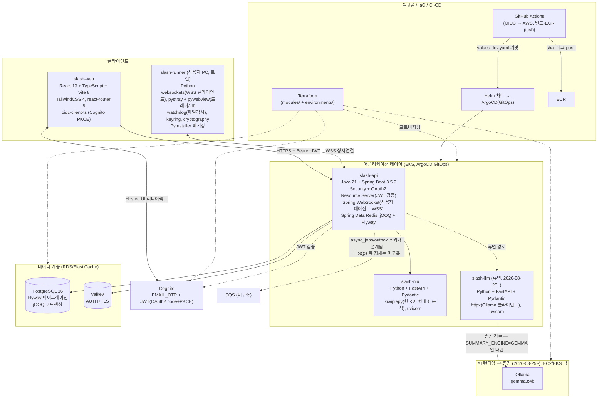

# 기술 스택 아키텍처

`docs/aws-architecture.md`가 AWS 리소스 토폴로지를, `docs/user-flow.md`가 요청 단위 흐름을
다룬다면, 이 문서는 "각 컴포넌트가 실제로 어떤 언어/프레임워크/라이브러리로 만들어졌는가"를
정리한다. 기준: 각 서비스 저장소(`slash-web`/`slash-api`/`slash-nlu`/`slash-llm`/`slash-runner`, 구 `slash-agent`)를
로컬 clone에서 직접 확인(2026-08-19) — `package.json`/`build.gradle.kts`/`requirements*.txt`/
`*.egg-info` 기준.

> **2026-08-25 갱신**: 아래 `slash-llm`/`Ollama` 관련 부분은 **더 이상 배포되지 않는다.**
> 제품 방향이 "클라우드에서 LLM을 직접 제공하지 않는다"로 바뀌면서 EKS의 `slash-llm`
> 배포와 Ollama EC2를 모두 destroy했다 — 요약 기능은 `slash-api`가
> `SUMMARY_ENGINE=EXTRACTIVE`(기본값)로 `slash-nlu`를 거쳐 처리한다. 코드
> 저장소(`slash-llm`)와 인프라 코드(`modules/llm-runtime`, `helm/slash-llm`)는 남아있어
> 스택 자체는 아래 표대로다 — 다만 지금 라이브로 도는 컴포넌트는 아니다. 상세는
> [`docs/operations-log.md`](operations-log.md) §23 참고.

## 서비스별 스택

| 서비스 | 언어/런타임 | 핵심 프레임워크·라이브러리 | 배포 형태 |
| --- | --- | --- | --- |
| `slash-web` | TypeScript, Node(빌드타임) | React 19, Vite 8, TailwindCSS 4, react-router 8, `oidc-client-ts` | 정적 빌드 → S3 + CloudFront (`modules/frontend-hosting`) |
| `slash-api` | Java 21 | Spring Boot 3.5.9 (Web/Validation/Actuator/Security/OAuth2 Resource Server/WebSocket/Data Redis), jOOQ, Flyway | 컨테이너 → EKS (Helm, ArgoCD) |
| `slash-nlu` | Python | FastAPI, Pydantic, `kiwipiepy`, uvicorn | 컨테이너 → EKS (Helm, ArgoCD) |
| `slash-llm` (휴면, 2026-08-25~) | Python | FastAPI, Pydantic, `httpx`, uvicorn | 코드는 남아있으나 EKS 배포 destroy — `terraform apply`로 복원 가능 |
| `slash-runner`(구 `slash-agent`) | Python | `websockets`, `pystray`, `pywebview`, `watchdog`, `keyring`, `cryptography` | PyInstaller 패키징, 사용자 PC에서 로컬 실행(AWS 범위 밖) |
| Ollama (휴면, 2026-08-25~) | — | `gemma3:4b` | EC2(`g4dn.xlarge`, GPU) destroy됨 — `modules/llm-runtime` 코드는 보존 |

## 확인된 사실 vs 설계뿐인 것

- **SQS는 아직 인프라에 없다.** `slash-api`의 `V006__create_async_jobs_outbox.sql` 마이그레이션
  주석("비동기 작업은 SQS가 담당한다")과 `async_jobs`/`outbox_events` 테이블 스키마는 SQS 발행을
  전제로 설계돼 있지만, `slash-infra` 저장소 전체를 검색해도 SQS 관련 Terraform 리소스는
  없다(`karpenter/README.md`의 SQS 언급은 스팟 인터럽션 큐 얘기로 무관). 즉 **outbox 패턴은
  코드/스키마 레벨로 준비돼 있고, 실제 큐 프로비저닝은 아직 이 저장소의 TODO로 남아있지 않다** —
  다음에 `slash-api` 쪽에서 이 경로를 실제로 쓰기 시작하면 `modules/`에 SQS(+ DLQ) 모듈이
  새로 필요하다는 뜻. `docs/user-flow.md` §2에서 확인한 자유입력 흐름은 이 outbox 경로가 아니라
  `slash-api → slash-nlu` 동기 호출이었다(2026-08-25 기준 — `slash-llm` 경유 경로는 휴면,
  위 갱신 노트 참고) — outbox가 어떤 작업 유형(`job_type`)에만 쓰이는지는 `slash-api` 쪽에
  후속 확인 필요.
- `slash-web`의 인증은 `oidc-client-ts`로 브라우저가 Cognito와 직접 PKCE 코드 교환을 하는
  구조로 확인됨(§1 `docs/user-flow.md`에 남겼던 추정이 이 라이브러리 존재로 뒷받침됨).
- `slash-api`가 agent와 주고받는 실시간 채널은 Spring WebSocket 의존성으로 실제 구현이
  뒷받침된다 — 다만 페어링된 agent에게 서버가 작업을 실제로 위임하는 흐름 자체는
  `docs/user-flow.md` §3에서 이미 밝혔듯 이번 확인 범위에서 재현되지 않았다.
