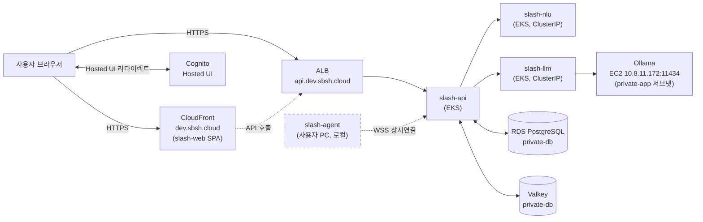
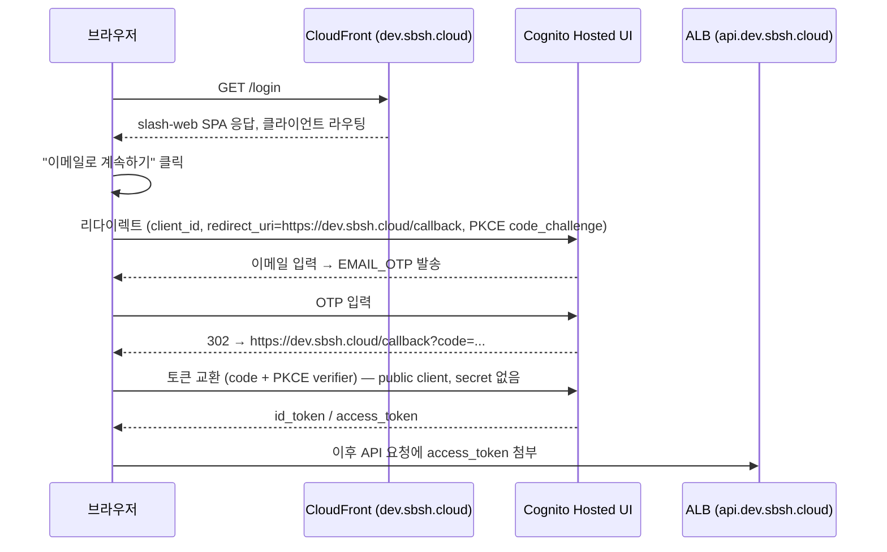
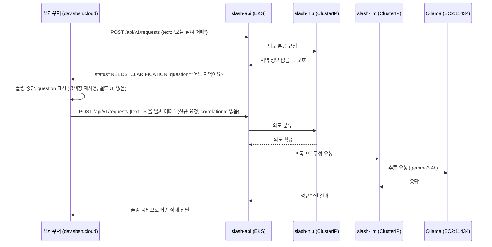
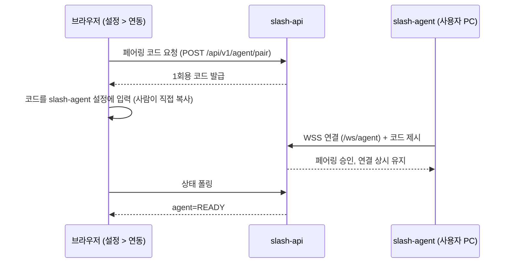

# 사용자 요청 흐름 (dev 환경 기준)

인프라 관점에서 "실제 사용자의 요청 한 건이 어느 컴포넌트를 거쳐 처리되는가"를 정리한 문서.
`docs/aws-architecture.md`가 "무엇을 어떻게 구축했는가"라면, 이 문서는 그 위에서 "요청이 실제로
어떤 경로로 흐르는가"를 다룬다. 기준 시점 2026-08-19, 대상은 상시 운영 중인 dev 환경
(`dev.sbsh.cloud` / `api.dev.sbsh.cloud`).

**표시 규칙**: ✅ = 브라우저로 직접 왕복까지 확인된 경로. 🔲 = 컴포넌트/설정은 존재하지만
end-to-end로 검증되진 않았거나 설계 의도상 추정한 경로(근거를 각주로 남김).

## 0. 전체 그림

`slash-agent`는 AWS 인프라 범위 밖(사용자 PC에서 로컬 실행)이라 위 그림에서도 별도 표시.
web ↔ agent 사이에는 AWS를 거치는 경로가 없다 — 브라우저가 agent에 직접 접속하는 길은 없고,
agent는 오직 `slash-api`로 나가는 outbound WSS 클라이언트다.

## 1. 로그인 (✅ 2026-08-18, `docs/operations-log.md` §11-7)

- 인증 플로우: `USER_AUTH` + `EMAIL_OTP`(비밀번호 없음), OAuth `code` grant only(Implicit 비허용),
  scope `openid email profile` — `modules/cognito/main.tf`.
- 콜백/로그아웃 URL은 `environments/dev/cognito` 기본값에 `https://dev.sbsh.cloud`가 이미
  등록되어 있었다(`environments/dev/cognito/variables.tf`).
- 토큰 교환을 브라우저가 Cognito와 직접 하는지, `slash-api`를 경유하는 BFF 패턴인지는
  `slash-web` 클라이언트 구현 소관이라 이 저장소 기준으로는 미확인 — `generate_secret = false`
  (public client)인 점으로 미루어 브라우저 직접 교환일 가능성이 높다는 추정만 남긴다.

## 2. 자유입력 요청 처리 (✅ 2026-08-18, §11-10)

- `slash-api`는 **stateless** 설계다 — `POST /api/v1/requests`가 `correlationId`를 받지 않고
  매 요청 새로 발급하므로, `NEEDS_CLARIFICATION` 이후 재입력은 "대화 이어가기"가 아니라
  완전히 새 요청이다. 대화형 스레드(`GENERAL_CHAT`, `/chat/:id`)는 아직 mock(`mockThreads.ts`)
  전용이고 실제로 붙지 않았다 — `slash-web` 이슈 #34로 후속 논의 이월.
  (근거: `slash-api/docs/frontend-api-contract.md` W1-04, `docs/operations-log.md` §11-10)
- 브라우저 → 백엔드 결과 수신은 **폴링**이다. `slash-web`에 WebSocket 클라이언트 자체가 없다
  (agent와의 흐름과 혼동하지 말 것, §3 참고).
- `slash-nlu`/`slash-llm`은 각각 `/health`(liveness)와 `/ready`(readiness)가 분리돼 있다
  (§11-4, §11-9) — Ollama가 죽어도 `slash-llm`의 `/health`는 여전히 `ok`를 반환하는 known gap
  (`docs/aws-architecture.md` §5-1 "미해결" 참고, readinessProbe에 아직 미반영).

## 3. 로컬 에이전트 페어링 (✅ 페어링/연결까지 검증, 🔲 실제 작업 위임은 미확인)

- 페어링 자체와 `READY` 상태 확인까지는 2026-08-18 세션에서 재현 확인
  (`docs/operations-log.md` §11-10: "설정 > 연동에서 새 코드 발급 → 재페어링 → READY 확인").
- **`slash-api`가 페어링된 agent에게 실제 작업(로컬 파일 검색 등)을 WSS로 위임하는 경로는
  이 세션에서 직접 검증되지 않았다** — §2의 자유입력 흐름은 nlu/llm만 거쳐 처리됐고 agent가
  개입한 형적은 없다. agent 쪽 로컬 파일 검색(`useLocalFileSearch.ts`)은 브라우저 File System
  Access API로 별도 동작하는 기능이라 이 페어링 경로와 무관하다는 점도 확인된 사실
  (메모리 `slash-web-agent-api-flow` 참고). 즉 지금 시점에 "페어링된 agent가 서버발 작업 지시를
  실제로 수행한다"까지 이어지는 그림은 설계 의도이지 검증된 동작은 아니다 — 이후 세션에서
  agent 작업 위임이 실제로 확인되면 이 섹션과 해당 메모리를 함께 갱신할 것.
- web은 agent에 직접 붙지 않는다(브라우저→agent 직접 경로 없음, §0 그림의 점선).

## 4. 도메인/엔드포인트 빠른 참조

| 구분 | 값 | 비고 |
| --- | --- | --- |
| 프론트엔드 | `https://dev.sbsh.cloud` | CloudFront + S3, `environments/dev/frontend` |
| 백엔드 API | `https://api.dev.sbsh.cloud` | ALB, `environments/dev/eks/domain.tf` |
| Cognito Hosted UI | `<name_prefix>-dev-<account_id>.auth.ap-northeast-2.amazoncognito.com` | `modules/cognito/main.tf` |
| slash-nlu | 클러스터 내부 `http://slash-nlu` (8001) | 외부 노출 없음 |
| slash-llm | 클러스터 내부 (8000) | 외부 노출 없음 |
| Ollama | `10.8.11.172:11434` (private) | EKS SG에서만 인바운드 허용 |

## 5. 알려진 갭 / 다음 확인 대상

- §3의 agent 작업 위임 경로 실동작 여부 — 다음에 자유입력이 아닌 "로컬 파일 관련" 요청을
  실제로 눌러봐서 agent가 개입하는지 네트워크 트래픽으로 확인 필요.
- 대화형 스레드(`GENERAL_CHAT`) 도입 시 이 문서의 §2 시퀀스(매 요청 stateless) 전체를
  다시 그려야 함 — `slash-web` 이슈 #34 진행 상황에 연동.
- `slash-llm` `/health`가 Ollama 상태를 반영하지 않는 gap이 readinessProbe에 반영되면
  §2 다이어그램에 실패 경로(Ollama 다운 시 어떻게 사용자에게 보이는지)를 추가할 것.
